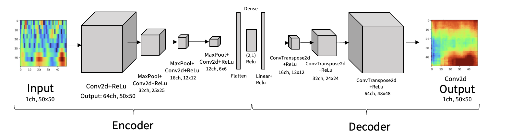

# Bearings-MAX78000: Condition Monitoring of Bearings

This repository details a practical approach to monitor the condition of bearings in industrial machinery. Using the NASA IMS bearing dataset, this project aims to detect potential failures in bearings early and accurately. The methodology encompasses data collection from a high-fidelity test rig, thorough preprocessing steps, and the utilization of a state-of-the-art microcontroller, the MAX78000, for real-time health prediction. The MAX78000's onboard CNN accelerator makes it particularly well-suited for deploying machine learning models directly onto edge devices, ensuring rapid and efficient inference.

### NASA IMS Test Rig
Data was collected from this rig in 2003, providing a comprehensive baseline for bearing performance under constant conditions.

### MAX78000 Microcontroller Board
Hosting the trained model, this compact, energy-efficient microcontroller board leverages its onboard CNN accelerator to predict bearing health in real-time.
Each blink of the LED indicates a single health prediction from raw accelerometer data.

## Dataset

- **Source**: NASA IMS bearing dataset, available for [download here](https://data.nasa.gov/download/brfb-gzcv/application/zip).
- **Focus**: Data from experiment 1, bearing 3.
- **Training Set**: `2003.11.01.21.51.44` to `2003.11.22.09.16.56`.
- **Validation Set**: `2003.11.22.09.26.56` to `2003.11.25.23.39.56`.
- **Test Set**: Experiments 2 and 3.
- **Sampling Rate**: 20kHz, resulting in 20480 samples (1 second of data) every 15 minutes.
- **Data Format**: Acceleration measurements in m/s², unfiltered.
- **Volume**:
  - Experiment 1: 2156 files.
  - Experiment 2: 984 files.
  - Experiment 3: 4448 files.
- **Recording Frequency**: 1 file every 15 mins during business hours. Initially (experiment 1), 1 file every 5 minutes.

### Expert Labels for Bearing 3

Labeling according to [source](https://github.com/Miltos-90/Failure_Classification_of_Bearings?tab=readme-ov-file):

- **Early**: `2003.10.22.12.06.24` to `2003.11.01.21.41.44` (not included in training dataset).
- **Normal**: `2003.11.01.21.51.44` to `2003.11.22.09.16.56`.
- **Suspect**: `2003.11.22.09.26.56` to `2003.11.25.10.47.32`.
- **Inner race failure**: `2003.11.25.10.57.32` to `2003.11.25.23.39.56`.

## Data Preprocessing

- **Windowing**: Data from bearing 3, experiment 1, split into windows of 200 samples; 30 windows averaged.
- **Transformation**: A Continuous Wavelet Transform (CWT) with Morlet wavelet is applied to each average window, resulting in 12x200 pixel images.
- **Resampling & Storage**: Images resampled to 50x50 pixels and stored as torch tensors.

## Model Architecture

The following model is trained:

The trained model is truncated to the latent vector layer, which is used as the output of the model. The truncated model is then quantized to 4-bit and used for predictions on the MAX78000.

## Training

- **Model**: An autoencoder trained on the first 300 files of the "normal" part of experiment 1.
- **Loss Function**: Mean Squared Error (MSE).
- **Quantization**: Post-training quantization to 4-bit.
- **Synthesis**: Synthesized for the MAX78000.
- **Configuration**: See `train.sh` for hyperparameters.
- **Evaluation**: Conducted on experiments 2 and 3 (unseen data).

## Results

Generated using `demo.py`:

- **Function**: Sends a window of 200 acceleration samples to a connected MAX78000, which performs a CWT transform, resamples the transform to 50x50, feeds the image to the CNN accelerator, and sends the output back to the host.
- **Output**: L2 norm of the latent vector layer of the autoencoder.
- **Smoothing**: Exponential smoothing applied on the MAX78000 output to reduce noise.
- **Inference Time**: 3.9 ms.
- **Total Time**: 318 ms (data preprocessing + inference).

### Visualizations

- **Experiment 1, Bearing 3** (trained on first 300 files):  
    
  *Note*: Inner race defect in bearing 3 and roller element defect in bearing 4 at the end of the experiment according to NASA dataset description.

- **Experiment 2, Bearing 3** (unseen data):  
    
  *Note*: No bearing 3 defect, but outer race failure in bearing 1 according to NASA dataset description.

- **Experiment 3, Bearing 3** (unseen data):  
    
  *Note*: Outer race failure in bearing 3 according to NASA dataset description.

## Repository Usage

### Overview

- `setup.sh`: Creates symlinks to model and dataset files from this repo to ai8x-training and ai8x-synthesis repos.
- `train.sh`: Script to run training, quantization, and synthesis scripts.
- `bearings-max78000/synthed_net`: Contains C code for the MAX78000.
- `playground.ipynb`: Jupyter notebook for testing the quantized model on the test set, simulating microcontroller's output.
- `firmware/`: Contains the firmware generated by `train.sh` for the MAX78000. Manual modification required; avoid overwriting with `synth_net`.

### Getting Started

- **Environment**: Python 3.8.11, Torch 1.8, Cuda 11, Ubuntu 22.04.
- **Repositories**: Clone [ai8x-training](https://github.com/MaximIntegratedAI/ai8x-training) and [ai8x-synthesis](https://github.com/MaximIntegratedAI/ai8x-synthesis), placed in the same parent directory as this repository.
- **Versions**:
  - ai8x-training hash: `b8bed2be513607427c487a6247dcd2963975b524`.
  - ai8x-synthesis hash: `35228561aeca21165456904a6ed274ae1e84ea64`.
- **Setup**: Follow the guide in `ai8x-training/README` to install required Python packages for ai8x-training and ai8x-synthesis. Set up two different conda environments. Pillow may need to be downgraded to 9.0.1 for tensorboard compatibility.
- **Symlinks**: Run `setup.sh` to create symlinks of model and dataset files in ai8x-training and ai8x-synthesis.
- **Training**: After successful setup, run `train.sh` to start training. Directly compile and flash the C code if retraining is not needed.
- **Debugging**: ai8x-training and synthesis can be cloned and run on an Ubuntu server. The synthed_net folder can be copied to a Mac for local debugging.
- **Guide**: Follow this [guide](https://analog-devices-msdk.github.io/msdk/USERGUIDE/#visual-studio-code) on MSDK with Visual Studio Code to debug on Mac.
- **Loss Function**: Set via an argument of `training.py` (`--regression` for regression (MSE), otherwise default is classification).

## References

- Qiu, Hai, et al. “Wavelet Filter-Based Weak Signature Detection Method and Its Application on Rolling Element Bearing Prognostics.” Journal of Sound and Vibration, 2006. [Link](https://doi.org/10.1016/j.jsv.2005.03.007).
- Kaji, Mohammadreza, et al. “Constructing a Reliable Health Indicator for Bearings.” Applied Sciences, 2020. [Link](https://doi.org/10.3390/app10248948).
- Wei, Xiao, and Dirk Söffker. “Comparison of CWRU Dataset-Based Diagnosis Approaches.” European Workshop on Structural Health Monitoring, 2021. [Link](https://doi.org/10.1007/978-3-030-64594-6_51).
